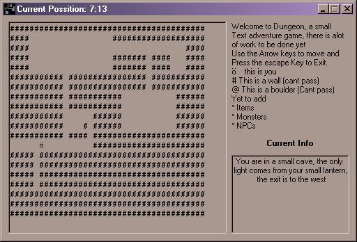



## Simple Text based Adventure

### Description

This is a simple Text based game in its early stages. It is intended to be a cross between the old unix games Adventure and Rouge (basicly a Rouge with more discriptions (sp?).

It reads maps and events from ASCII text files so the maps etc are Easy to change. I have yet to add monsters, items or anything else and mabey in some release Imight try stringing together a random map generator. Hope you like it,

oeb
 
### More Info
 

             |
---                |---
**Submitted On**   |2002-04-23 15:19:18
**By**             |[oeb](https://github.com/Planet-Source-Code/PSCIndex/blob/master/ByAuthor/oeb.md)
**Level**          |Beginner
**User Rating**    |4.5 (27 globes from 6 users)
**Compatibility**  |VB 6\.0
**Category**       |[Games](https://github.com/Planet-Source-Code/PSCIndex/blob/master/ByCategory/games__1-38.md)
**World**          |[Visual Basic](https://github.com/Planet-Source-Code/PSCIndex/blob/master/ByWorld/visual-basic.md)
**Archive File**   |[Simple\_Tex748744232002\.zip](https://github.com/Planet-Source-Code/oeb-simple-text-based-adventure__1-34068/archive/master.zip)

### API Declarations

uses timegettime, GetAsyncKeyState and getactivewindow

